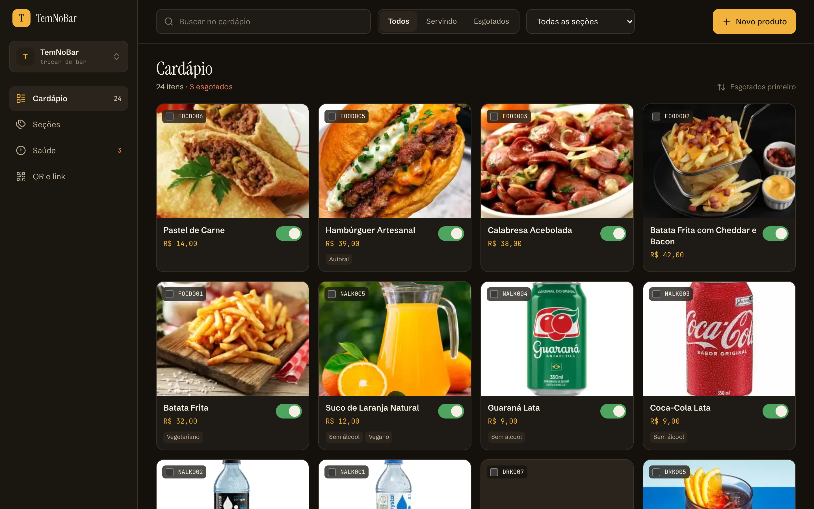
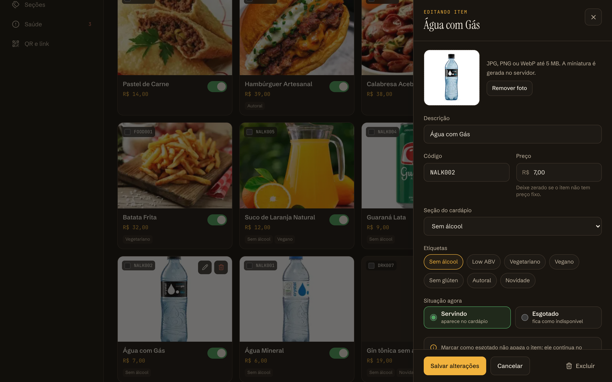
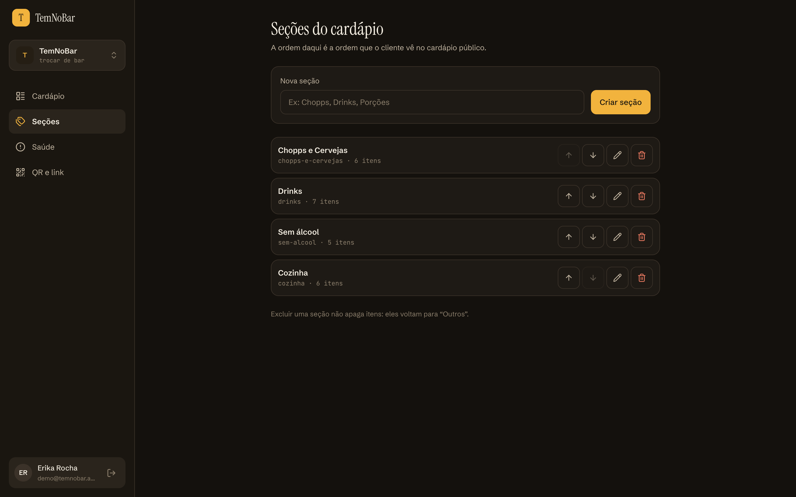
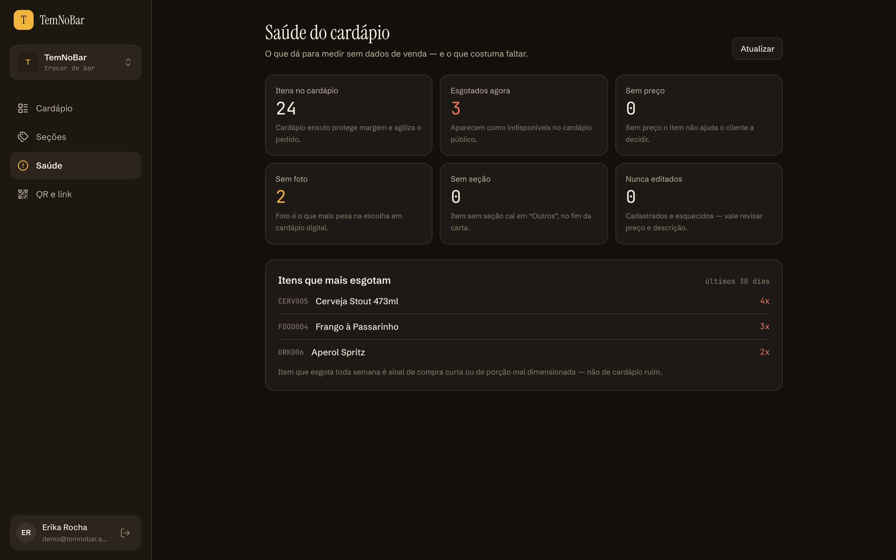
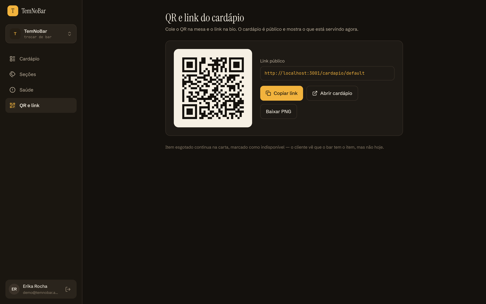
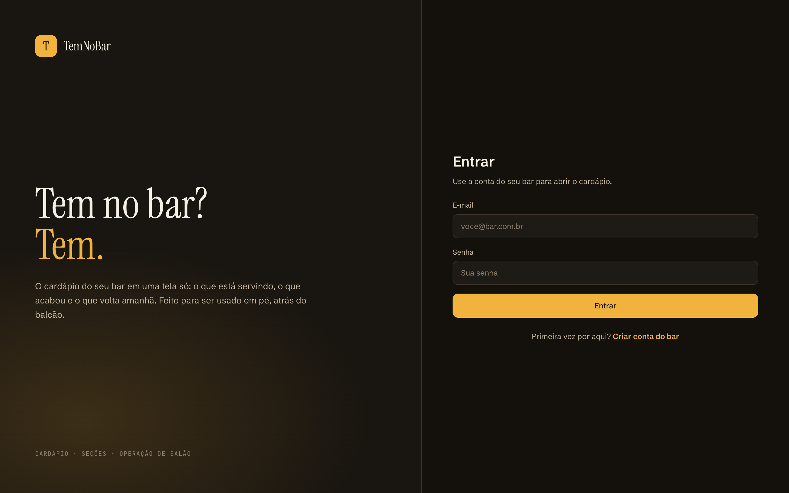
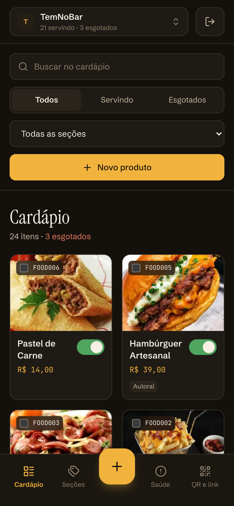
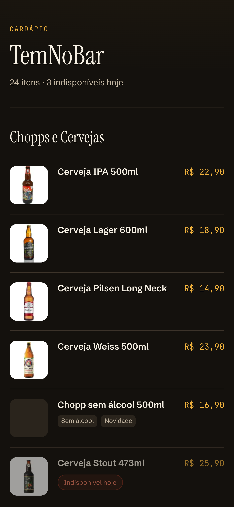
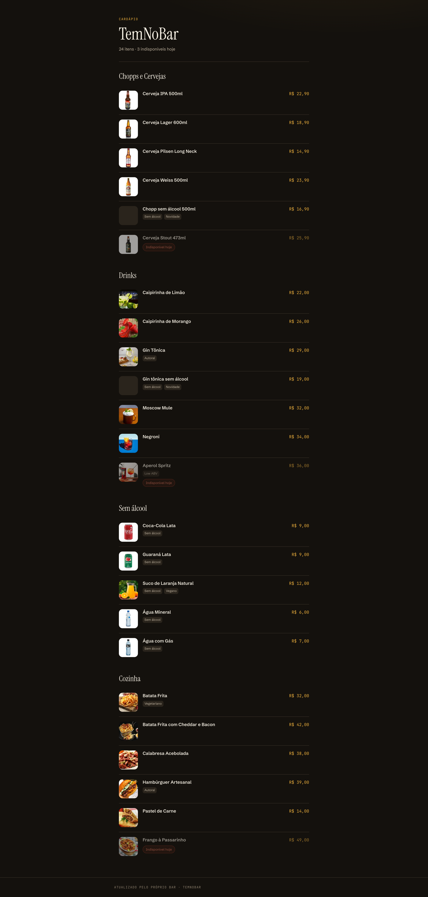

# TemNoBar Web


> **Tem no bar? Tem.** O frontend que coloca o cardápio do seu bar na palma da mão.

Interface web para gestão de cardápios de bares, permitindo cadastro, edição e organização de produtos com suporte a imagens, busca e filtros.

---

## Stack

| Camada | Tecnologia |
|--------|-----------|
| Framework | Next.js 16 (App Router) |
| UI | React 19 |
| Linguagem | TypeScript |
| Estilização | Tailwind CSS 4 |
| Formulários | React Hook Form + Zod |
| HTTP Client | Axios |
| Autenticação | Cookies httpOnly (via API) |

---

## Telas

| Cardápio | Painel de edição |
|---|---|
|  |  |

| Seções | Saúde do cardápio |
|---|---|
|  |  |

| QR e link público | Entrada |
|---|---|
|  |  |

| No celular | Cardápio público no celular |
|---|---|
|  |  |

O cardápio público inteiro, como o cliente vê ao ler o QR da mesa:



---

## Início Rápido

### Pré-requisitos

- Node.js 20+
- [TemNoBar API](https://github.com/erikarg/temnobar-api) rodando localmente ou em produção

### Instalação

```bash
# Clone o repositório
git clone https://github.com/erikarg/temnobar-web.git
cd temnobar-web

# Instale as dependências
npm install

# Configure as variáveis de ambiente
cp .env.example .env

# Inicie o servidor de desenvolvimento
npm run dev
```

A aplicação estará disponível em `http://localhost:3000`.

### Variáveis de Ambiente

| Variável | Descrição | Exemplo |
|----------|-----------|---------|
| `NEXT_PUBLIC_API_URL` | URL base da API (com `/api/v1`) | `http://localhost:3333/api/v1` |

---

## Arquitetura

```
temnobar-web/
├── app/                   # Páginas (App Router)
│   ├── layout.tsx         #   Layout raiz + AuthProvider
│   ├── page.tsx           #   Cardápio (lista, filtros, painel de edição)
│   ├── login/             #   Tela de login
│   ├── register/          #   Tela de registro
│   ├── select-bar/        #   Seleção/criação de bar
│   ├── categorias/        #   Seções do cardápio
│   ├── saude/             #   Saúde do cardápio
│   ├── qr/                #   QR code e link público
│   ├── cardapio/[slug]/   #   Cardápio público (server component)
│   └── products/          #   Rotas antigas, redirecionam para o painel
├── components/            # Componentes
│   ├── ui/                #   Primitivos (Input, Button)
│   ├── AppShell.tsx       #   Rail, troca de bar e navegação inferior
│   ├── AuthProvider.tsx   #   Sessão compartilhada
│   ├── ProductCard.tsx    #   Card com preço, etiquetas e disponibilidade
│   ├── ProductSheet.tsx   #   Painel lateral de criação/edição
│   └── TagChip.tsx        #   Etiqueta de item
├── hooks/                 # useAuth, useProducts
├── lib/                   # money.ts (centavos), tags.ts (vocabulário)
├── services/              # api, auth, bar, category, product, upload, menu
└── types/                 # user, bar, category, product, menu
```

---

## Funcionalidades

### Autenticação

- Login e registro com validação de formulário (Zod)
- Sessão via cookies httpOnly gerenciados pela API
- Redirecionamento automático para login quando não autenticado
- Logout com limpeza de cookie

### Seleção de Bar

- Lista de bares disponíveis
- Criação de novo bar com geração automática de slug
- Vinculação do usuário ao bar selecionado

### Cardápio

- Listagem em grid com busca, filtro por situação e por seção
- Preço por item (centavos na API, exibição em reais)
- Etiquetas de vocabulário fechado (sem álcool, low ABV, vegetariano, autoral…)
- Disponibilidade em um toque, direto no card, com registro de histórico
- Seleção múltipla para marcar vários itens como esgotados de uma vez
- Criação e edição em painel lateral, sem sair da lista
- Exclusão com confirmação

### Seções

- Criação com slug derivado do nome
- Reordenação, que define a ordem do cardápio público
- Excluir a seção não apaga itens: eles voltam para "Outros"

### Cardápio público

- Página server-rendered em `/cardapio/:slug`, com metadata para busca
- Item esgotado permanece na carta, marcado como indisponível
- QR code e link prontos para mesa e bio

### Saúde do cardápio

- Itens sem foto, sem preço, sem seção e nunca editados
- Ranking dos itens que mais esgotam nos últimos 30 dias

### Design

Identidade **Balcão**: fundo escuro quente (`#14110D`), âmbar como única cor de
ação (`#F2B33D`), verde e vinho reservados a estado. Instrument Serif no display,
Schibsted Grotesk na interface e JetBrains Mono em código e preço. Alvo de toque
mínimo de 44px, pensado para uso em pé e com pouca luz.

---

## Páginas

| Rota | Descrição | Autenticação |
|------|-----------|:------------:|
| `/login` | Tela de login | — |
| `/register` | Tela de registro | — |
| `/cardapio/:slug` | Cardápio público do bar (indexável) | — |
| `/select-bar` | Seleção ou criação de bar | Cookie |
| `/` | Cardápio do bar, com painel de edição em `?item=` | Cookie |
| `/categorias` | Seções do cardápio | Cookie |
| `/saude` | Saúde do cardápio | Cookie |
| `/qr` | QR code e link público | Cookie |

---

## Scripts

| Comando | Descrição |
|---------|-----------|
| `npm run dev` | Inicia o servidor de desenvolvimento |
| `npm run build` | Gera o build de produção |
| `npm start` | Executa o build de produção |
| `npm run lint` | Verifica o código com ESLint |
| `npm run typecheck` | Checa os tipos com o TypeScript |

---

## Licença

Este projeto é de uso pessoal. Consulte o autor para permissões de uso.
