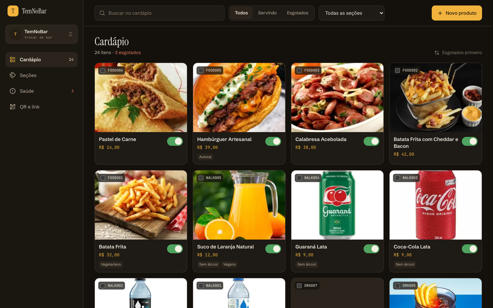
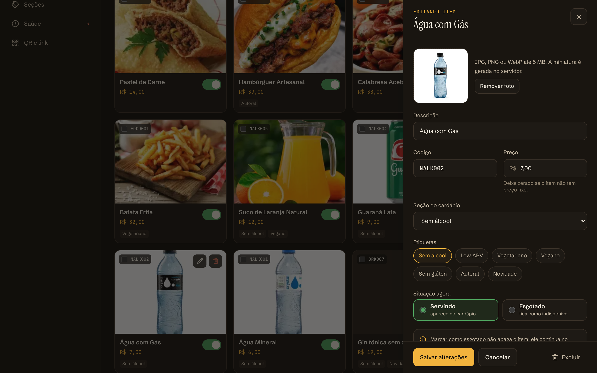
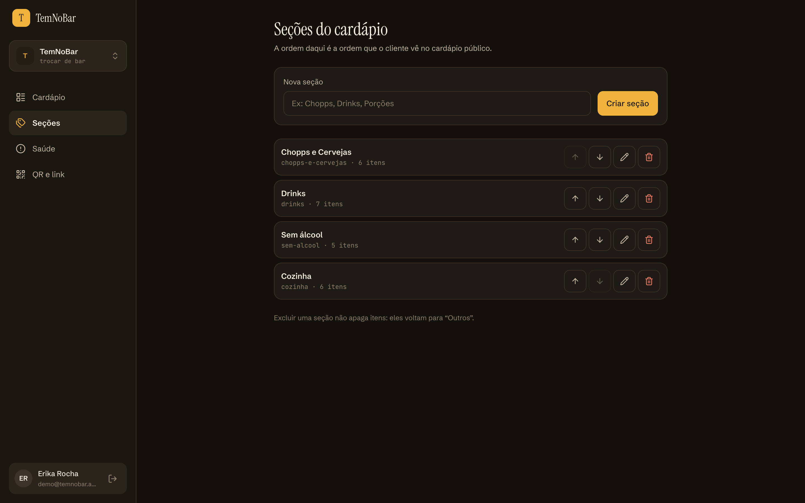
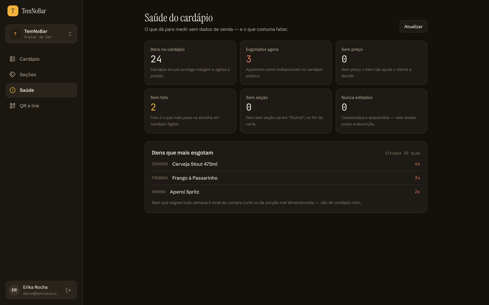
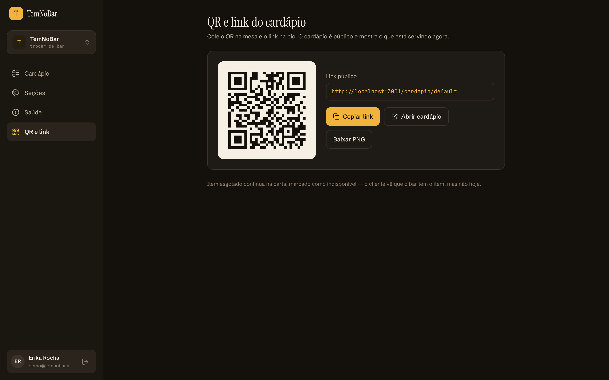
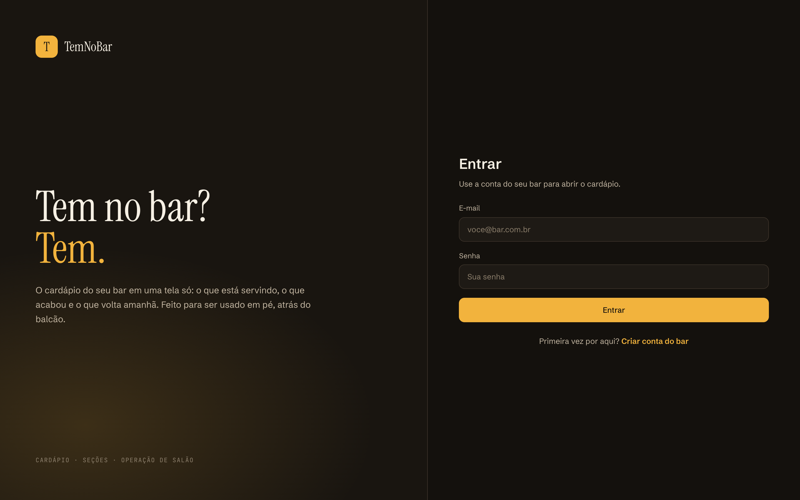
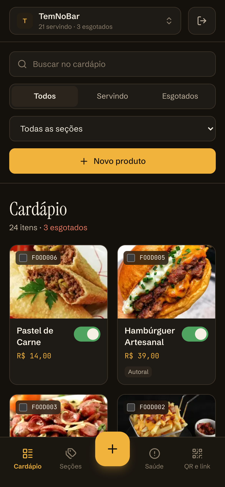
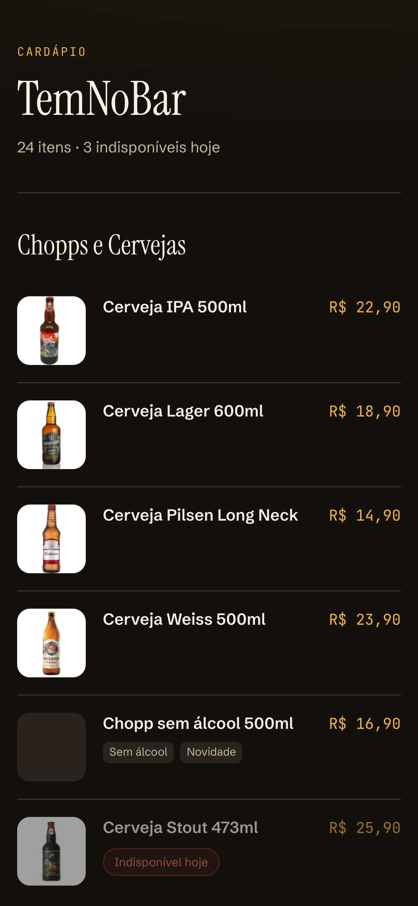
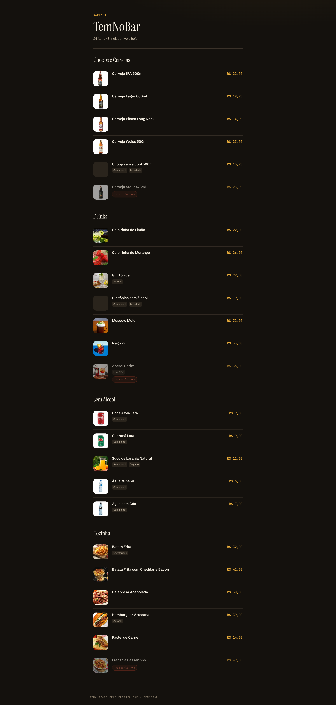

# TemNoBar Web


> **Tem no bar? Tem.** The front end that puts your bar's menu in the palm of your hand.

Web back office for bar menus — products with price, tags, photos and one-tap availability, menu sections, menu health — plus the public menu customers open from the table QR code.

**Live demo:** https://temnobar-web.vercel.app

It is part of the TemNoBar trio:

| Repo | What it is | Live |
|------|-----------|------|
| [temnobar-api](https://github.com/erikarg/temnobar-api) | REST API (Express + Prisma + PostgreSQL) | https://temnobar-api.vercel.app ([docs](https://temnobar-api.vercel.app/docs)) |
| **temnobar-web** | This web app (Next.js) | https://temnobar-web.vercel.app |
| [temnobar-app](https://github.com/erikarg/temnobar-app) | Mobile app (Expo / React Native) | — |

---

## Stack

| Layer | Technology |
|-------|-----------|
| Framework | Next.js 16 (App Router) |
| UI | React 19 |
| Language | TypeScript |
| Styling | Tailwind CSS 4 |
| Forms | React Hook Form + Zod |
| HTTP client | Axios |
| Auth | httpOnly cookie set by the API |
| Tests | Vitest |

---

## Screens

| Menu | Edit panel |
|---|---|
|  |  |

| Sections | Menu health |
|---|---|
|  |  |

| QR and public link | Sign in |
|---|---|
|  |  |

| On a phone | Public menu on a phone |
|---|---|
|  |  |

The whole public menu, as a customer sees it after scanning the table QR code:



---

## Getting started

### Prerequisites

- Node.js 20+
- A running [TemNoBar API](https://github.com/erikarg/temnobar-api), local or the live one

### Install and run

```bash
git clone https://github.com/erikarg/temnobar-web.git
cd temnobar-web
npm install
cp .env.example .env
npm run dev
```

The app runs on http://localhost:3000. For the API's CORS and origin guard to accept it, the API's `APP_URL` must include `http://localhost:3000`.

### Environment variables

| Variable | Required | Description | Example |
|----------|:--------:|-------------|---------|
| `NEXT_PUBLIC_API_URL` | yes | API base URL, including `/api/v1`. The app throws on start without it. | `http://localhost:3333/api/v1` |

`NEXT_PUBLIC_*` values are inlined at build time: change them and rebuild. The API host is also allowed in `next.config.ts` for `next/image`, next to `res.cloudinary.com`.

### Tests

```bash
npm test
```

Vitest unit tests (in `tests/`) for the pure helpers: price formatting and parsing in `lib/money.ts` (cents ↔ reais, zero included) and the tag labels and vocabulary in `lib/tags.ts`.

---

## Deployment

The app is deployed on **Vercel** (Next.js preset) at https://temnobar-web.vercel.app.

- Set `NEXT_PUBLIC_API_URL` (for example `https://temnobar-api.vercel.app/api/v1`) in **every** Vercel environment that builds the project, Preview included. It is read at build time, and the build or the app fails without it.
- The API's `APP_URL` must list the web origin (`https://temnobar-web.vercel.app`, plus any Preview URL you want to use), or CORS and the API's origin guard will reject the requests.
- See [temnobar-api](https://github.com/erikarg/temnobar-api#deployment) for the API side.

### Known limitation: third-party session cookie

The web app (`temnobar-web.vercel.app`) and the API (`temnobar-api.vercel.app`) are **different sites**. `vercel.app` is a public suffix, so the two subdomains do not count as the same site. In production the API sets the session as `token`, `HttpOnly; Secure; SameSite=None`, 7 days, on its own host. The browser calls the API with `withCredentials: true`, so for the browser this is a **third-party cookie**.

Browsers or settings that block third-party cookies can break login: the login request succeeds, but the cookie is not stored or not sent back, so the next call (`/auth/me`) answers `401` and the app goes back to `/login`. The public menu (`/cardapio/:slug`) is not affected, because it is fetched on the server, with no cookie.

The usual fix is to serve web and API from the same site, for example `app.example.com` and `api.example.com` on a custom domain, or to proxy the API through the Next.js app. Neither is implemented.

---

## Architecture

```
temnobar-web/
├── app/                   # Pages (App Router)
│   ├── layout.tsx         #   Root layout + AuthProvider
│   ├── page.tsx           #   Menu (list, filters, edit panel)
│   ├── login/             #   Login
│   ├── register/          #   Sign up
│   ├── select-bar/        #   Pick or create a bar
│   ├── categorias/        #   Menu sections
│   ├── saude/             #   Menu health
│   ├── qr/                #   QR code and public link
│   ├── cardapio/[slug]/   #   Public menu (server component)
│   └── products/          #   Old routes, redirect to the panel
├── components/
│   ├── ui/                #   Primitives (Input, Button)
│   ├── AppShell.tsx       #   Rail, bar switcher and bottom navigation
│   ├── AuthProvider.tsx   #   Shared session
│   ├── ProductCard.tsx    #   Card with price, tags and availability
│   ├── ProductSheet.tsx   #   Side panel to create/edit
│   └── TagChip.tsx        #   Item tag
├── hooks/                 # useAuth, useProducts
├── lib/                   # money.ts (cents), tags.ts (vocabulary)
├── services/              # api, auth, bar, category, product, upload, menu
├── tests/                 # Vitest unit tests
└── types/                 # user, bar, category, product, menu
```

---

## Features

- **Auth:** login and sign-up with Zod validation; session in the API's httpOnly cookie; a `401` sends you back to login; logout clears the cookie.
- **Bar selection:** list bars, create one (slug generated from the name) and link the user to it.
- **Menu:** grid with search, filter by status and by section; price per item (cents in the API, shown in reais); closed tag vocabulary (sem álcool, low ABV, vegetariano, autoral…); one-tap availability on the card, with history; multi-select to mark several items as sold out; create and edit in a side panel without leaving the list; delete with confirmation.
- **Sections:** create (slug from the name), reorder (sets the order of the public menu); deleting a section keeps its items, which move to "Outros".
- **Public menu:** server-rendered at `/cardapio/:slug`, with metadata for search engines; sold-out items stay on the menu, marked as unavailable; QR code and link ready for tables and bios.
- **Menu health:** items without photo, price or section, never edited; ranking of the items that sold out most often in the last 30 days.

### Design

**Balcão** identity: warm dark background (`#14110D`), amber as the only action colour (`#F2B33D`), green and wine reserved for state. Instrument Serif for display, Schibsted Grotesk for the interface and JetBrains Mono for code and prices. Minimum 44px touch targets, designed for use standing up in low light.

---

## Pages

| Route | Description | Auth |
|-------|-------------|:----:|
| `/login` | Login | — |
| `/register` | Sign up | — |
| `/cardapio/:slug` | Public menu of the bar (indexable) | — |
| `/select-bar` | Pick or create a bar | Cookie |
| `/` | The bar's menu, with the edit panel at `?item=` | Cookie |
| `/categorias` | Menu sections | Cookie |
| `/saude` | Menu health | Cookie |
| `/qr` | QR code and public link | Cookie |

---

## Scripts

| Command | Description |
|---------|-------------|
| `npm run dev` | Development server |
| `npm run build` | Production build |
| `npm start` | Run the production build |
| `npm run lint` | ESLint |
| `npm run typecheck` | TypeScript check |
| `npm test` | Unit tests (Vitest) |

---

## License

Personal-use project. Ask the author before reusing it.

---

<details>
<summary>Português</summary>

# TemNoBar Web

> **Tem no bar? Tem.** O frontend que coloca o cardápio do seu bar na palma da mão.

Back office web para cardápios de bares — produtos com preço, etiquetas, foto e disponibilidade em um toque, seções do cardápio, saúde do cardápio — e o cardápio público que o cliente abre pelo QR da mesa.

**Demo no ar:** https://temnobar-web.vercel.app

Faz parte do trio TemNoBar:

| Repositório | O que é | No ar |
|-------------|---------|-------|
| [temnobar-api](https://github.com/erikarg/temnobar-api) | API REST (Express + Prisma + PostgreSQL) | https://temnobar-api.vercel.app ([docs](https://temnobar-api.vercel.app/docs)) |
| **temnobar-web** | Este app web (Next.js) | https://temnobar-web.vercel.app |
| [temnobar-app](https://github.com/erikarg/temnobar-app) | App mobile (Expo / React Native) | — |

## Stack

| Camada | Tecnologia |
|--------|-----------|
| Framework | Next.js 16 (App Router) |
| UI | React 19 |
| Linguagem | TypeScript |
| Estilização | Tailwind CSS 4 |
| Formulários | React Hook Form + Zod |
| HTTP | Axios |
| Autenticação | Cookie httpOnly definido pela API |
| Testes | Vitest |

## Telas

As capturas de tela estão na seção **Screens**, acima.

## Início rápido

### Pré-requisitos

- Node.js 20+
- A [TemNoBar API](https://github.com/erikarg/temnobar-api) rodando, local ou a do ar

### Instalação e execução

```bash
git clone https://github.com/erikarg/temnobar-web.git
cd temnobar-web
npm install
cp .env.example .env
npm run dev
```

A aplicação fica em http://localhost:3000. Para o CORS e o origin guard da API aceitarem, o `APP_URL` da API precisa incluir `http://localhost:3000`.

### Variáveis de ambiente

| Variável | Obrigatória | Descrição | Exemplo |
|----------|:-----------:|-----------|---------|
| `NEXT_PUBLIC_API_URL` | sim | URL base da API, com `/api/v1`. Sem ela o app falha ao iniciar. | `http://localhost:3333/api/v1` |

Variáveis `NEXT_PUBLIC_*` são embutidas no build: mudou, rebuilde. O host da API também é liberado no `next.config.ts` para o `next/image`, junto com `res.cloudinary.com`.

### Testes

```bash
npm test
```

Testes unitários com Vitest (em `tests/`) para os helpers puros: formatação e leitura de preço em `lib/money.ts` (centavos ↔ reais, inclusive zero) e os rótulos e o vocabulário de etiquetas em `lib/tags.ts`.

## Deploy

O app está na **Vercel** (preset Next.js) em https://temnobar-web.vercel.app.

- Defina `NEXT_PUBLIC_API_URL` (por exemplo `https://temnobar-api.vercel.app/api/v1`) em **todos** os ambientes da Vercel que buildam o projeto, inclusive Preview. Ela é lida no build, e o build ou o app falha sem ela.
- O `APP_URL` da API precisa listar a origem do web (`https://temnobar-web.vercel.app`, mais qualquer URL de Preview que você queira usar); senão o CORS e o origin guard da API rejeitam as requisições.
- Veja o lado da API em [temnobar-api](https://github.com/erikarg/temnobar-api#deployment).

### Limitação conhecida: cookie de sessão de terceiros

O app web (`temnobar-web.vercel.app`) e a API (`temnobar-api.vercel.app`) são **sites diferentes**. `vercel.app` é um sufixo público, então os dois subdomínios não contam como o mesmo site. Em produção, a API grava a sessão como `token`, `HttpOnly; Secure; SameSite=None`, 7 dias, no próprio host. O navegador chama a API com `withCredentials: true`, então, para ele, esse é um **cookie de terceiros**.

Navegadores ou configurações que bloqueiam cookies de terceiros podem quebrar o login: a requisição de login dá certo, mas o cookie não é guardado ou não é reenviado, então a chamada seguinte (`/auth/me`) responde `401` e o app volta para `/login`. O cardápio público (`/cardapio/:slug`) não é afetado, porque é buscado no servidor, sem cookie.

A correção usual é servir web e API no mesmo site, por exemplo `app.exemplo.com` e `api.exemplo.com` em um domínio próprio, ou fazer proxy da API pelo próprio Next.js. Nenhuma das duas está implementada.

## Arquitetura

```
temnobar-web/
├── app/                   # Páginas (App Router)
│   ├── layout.tsx         #   Layout raiz + AuthProvider
│   ├── page.tsx           #   Cardápio (lista, filtros, painel de edição)
│   ├── login/             #   Login
│   ├── register/          #   Cadastro
│   ├── select-bar/        #   Seleção/criação de bar
│   ├── categorias/        #   Seções do cardápio
│   ├── saude/             #   Saúde do cardápio
│   ├── qr/                #   QR code e link público
│   ├── cardapio/[slug]/   #   Cardápio público (server component)
│   └── products/          #   Rotas antigas, redirecionam para o painel
├── components/
│   ├── ui/                #   Primitivos (Input, Button)
│   ├── AppShell.tsx       #   Rail, troca de bar e navegação inferior
│   ├── AuthProvider.tsx   #   Sessão compartilhada
│   ├── ProductCard.tsx    #   Card com preço, etiquetas e disponibilidade
│   ├── ProductSheet.tsx   #   Painel lateral de criação/edição
│   └── TagChip.tsx        #   Etiqueta de item
├── hooks/                 # useAuth, useProducts
├── lib/                   # money.ts (centavos), tags.ts (vocabulário)
├── services/              # api, auth, bar, category, product, upload, menu
├── tests/                 # Testes unitários (Vitest)
└── types/                 # user, bar, category, product, menu
```

## Funcionalidades

- **Autenticação:** login e cadastro com validação Zod; sessão no cookie httpOnly da API; um `401` leva de volta ao login; logout apaga o cookie.
- **Seleção de bar:** lista os bares, cria um novo (slug gerado a partir do nome) e vincula o usuário a ele.
- **Cardápio:** grid com busca, filtro por situação e por seção; preço por item (centavos na API, exibição em reais); etiquetas de vocabulário fechado (sem álcool, low ABV, vegetariano, autoral…); disponibilidade em um toque no card, com histórico; seleção múltipla para marcar vários itens como esgotados; criação e edição em painel lateral, sem sair da lista; exclusão com confirmação.
- **Seções:** criação (slug derivado do nome), reordenação (define a ordem do cardápio público); excluir a seção não apaga itens, que vão para "Outros".
- **Cardápio público:** renderizado no servidor em `/cardapio/:slug`, com metadata para busca; item esgotado permanece na carta, marcado como indisponível; QR code e link prontos para mesa e bio.
- **Saúde do cardápio:** itens sem foto, sem preço, sem seção e nunca editados; ranking dos itens que mais esgotam nos últimos 30 dias.

### Design

Identidade **Balcão**: fundo escuro quente (`#14110D`), âmbar como única cor de ação (`#F2B33D`), verde e vinho reservados a estado. Instrument Serif no display, Schibsted Grotesk na interface e JetBrains Mono em código e preço. Alvo de toque mínimo de 44px, pensado para uso em pé e com pouca luz.

## Páginas

| Rota | Descrição | Autenticação |
|------|-----------|:------------:|
| `/login` | Login | — |
| `/register` | Cadastro | — |
| `/cardapio/:slug` | Cardápio público do bar (indexável) | — |
| `/select-bar` | Seleção ou criação de bar | Cookie |
| `/` | Cardápio do bar, com painel de edição em `?item=` | Cookie |
| `/categorias` | Seções do cardápio | Cookie |
| `/saude` | Saúde do cardápio | Cookie |
| `/qr` | QR code e link público | Cookie |

## Scripts

| Comando | Descrição |
|---------|-----------|
| `npm run dev` | Servidor de desenvolvimento |
| `npm run build` | Build de produção |
| `npm start` | Executa o build de produção |
| `npm run lint` | ESLint |
| `npm run typecheck` | Checagem de tipos |
| `npm test` | Testes unitários (Vitest) |

## Licença

Projeto de uso pessoal. Consulte a autora antes de reutilizar.

</details>
